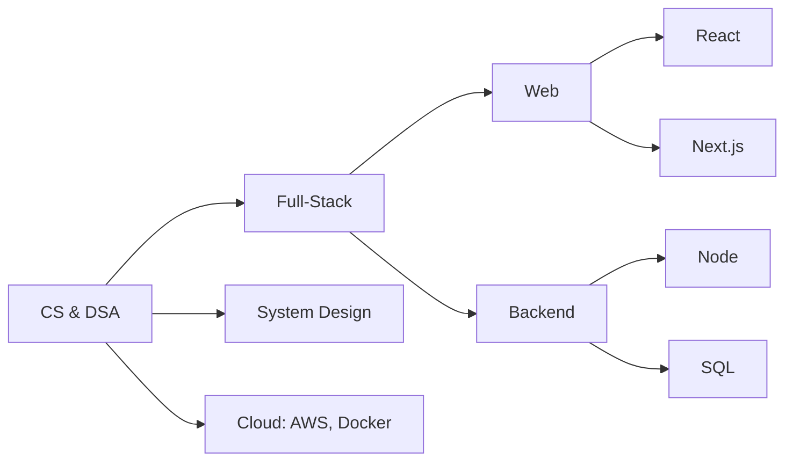

# Hey, I'm Rishabh Jain 👋

<!-- Profile counters & socials -->

---
## 👤 About Me
- 🌍 Location: Delhi
- 📚 Currently Learning: System Design, Cloud, DSA
- 💻 Interested In: Full-stack, AI Agents
- ❓ Ask Me About: React, Node.js, Databases
- ☕ Fun Fact: Tea + Keyboard = Features
- 📬 Hire Me: rishabhjainonly@gmail.com

---

## Tech Arsenal

**Languages**

**Frontend**

**Backend & DB**

**Cloud & DevOps**

---

## GitHub Analytics

<!-- Auto-dark/light using <picture>. Change theme params if you prefer. -->

  <picture>
    <source media="(prefers-color-scheme: dark)" srcset="https://github-readme-stats.vercel.app/api?username=RishabhJain-31&show_icons=true&hide_title=false&rank_icon=github&include_all_commits=true&theme=tokyonight" />
    <source media="(prefers-color-scheme: light)" srcset="https://github-readme-stats.vercel.app/api?username=RishabhJain-31&show_icons=true&hide_title=false&rank_icon=github&include_all_commits=true" />
    
  </picture>

  <picture>
    <source media="(prefers-color-scheme: dark)" srcset="https://streak-stats.demolab.com?user=RishabhJain-31&theme=tokyonight&hide_border=false" />
    <source media="(prefers-color-scheme: light)" srcset="https://streak-stats.demolab.com?user=RishabhJain-31" />
    
  </picture>

  <picture>
    <source media="(prefers-color-scheme: dark)" srcset="https://github-readme-stats.vercel.app/api/top-langs/?username=RishabhJain-31&layout=compact&langs_count=10&theme=tokyonight" />
    <source media="(prefers-color-scheme: light)" srcset="https://github-readme-stats.vercel.app/api/top-langs/?username=RishabhJain-31&layout=compact&langs_count=10" />
    
  </picture>

  <picture>
    <source media="(prefers-color-scheme: dark)" srcset="https://github-readme-activity-graph.vercel.app/graph?username=RishabhJain-31&theme=github-dark" />
    <source media="(prefers-color-scheme: light)" srcset="https://github-readme-activity-graph.vercel.app/graph?username=RishabhJain-31&theme=github" />
    
  </picture>

  

---

## Coding

    
    
  
  

---

## 🛠 Current Focus
Visualizing my current roadmap:

### 🎯 Achievements & Hobbies
- ♟ **Chess Enthusiast** | **FIDE rating: 1580**
- 🏆 **Intra-College Chess Champion**
- 💡 Always up for strategic challenges!

---
### 🚀 Let’s Connect

  
  <a href="mailto:rishabhjainonly@gmail.com">Email</a> | 
  <a href="https://www.linkedin.com/in/rishabh-jain-45341124a/">LinkedIn</a>

---
