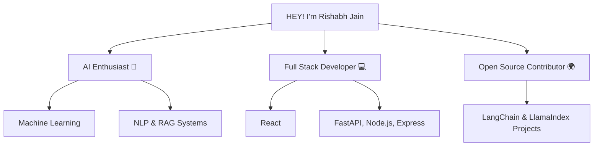

<h1 align="center"><b>HEY! I'm Rishabh Jain👋</b></h1>

  

  
   
  
   
  

---

## 💫 **About Me**
- 🎓 **CS Undergrad** passionate about **Full-Stack Development**
- ♟️ **Chess Player** – Winner of **Intra-College Tournament** | **FIDE Rating: 1580**
- 🚀 Exploring **DSA**, **System Design**, and **Cloud**
- 🌱 Currently learning **Next.js**, **AWS**, **Docker**
- ✍ Love writing clean & scalable code

---
### ✨ **Tech Stack**

  

---

## 🏆 **Achievements & Profiles**

  
   
  

---

### 🛠 Workflow Overview

## 📊 **GitHub Stats**

  
   
  

---

## 📈 **Contribution Graph**

  

---

## **My Resume-

  

